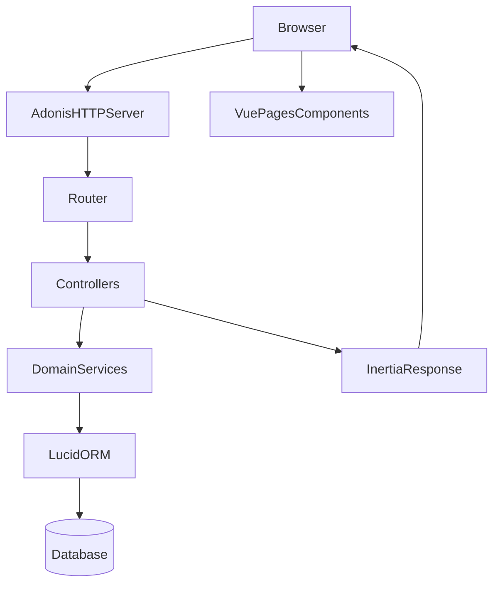

# Architecture — vue d’ensemble

## Composants

- **Backend**: AdonisJS v7 (TypeScript) — routes → controllers → services → Lucid (PostgreSQL/SQLite)
- **Frontend**: Inertia + Vue 3 — pages dans `inertia/pages/**` résolues par `inertia/app.ts`
- **DB**: migrations dans `database/migrations/**`, schéma généré dans `database/schema.ts`

## Diagramme

## Points d’entrée (fichiers)

- **Routes**: `start/routes.ts` (importe `start/routes/*.ts`)
- **Kernel (middlewares)**: `start/kernel.ts`
- **Inertia app**: `inertia/app.ts`

## Conventions (pour rester scalable)

- **Controllers fins**: orchestrent auth/acl/validation, délèguent la logique métier aux services.
- **Services**: contiennent la logique métier réutilisable, testable unitairement.
- **Validation**: VineJS dans `app/validators/**`.
- **ACL**: Bouncer abilities dans `app/abilities/main.ts` + middleware `initialize_bouncer_middleware`.

