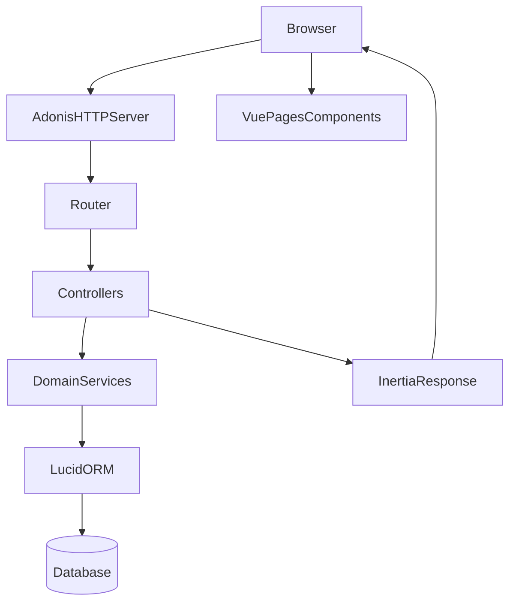

# Architecture — vue d’ensemble

## Composants

- **Backend**: AdonisJS v7 (TypeScript) — routes → controllers → services → Lucid (PostgreSQL/SQLite)
- **Frontend**: Inertia + Vue 3 — pages dans `inertia/pages/**` résolues par `inertia/app.ts`
- **DB**: migrations dans `database/migrations/**`, schéma généré dans `database/schema.ts`

## Diagramme

```mermaid
flowchart TD
  Browser[Browser]
  Adonis[AdonisHTTPServer]
  Router[Router]
  Controllers[Controllers]
  Services[DomainServices]
  Lucid[LucidORM]
  DB[(Database)]
  Inertia[InertiaResponse]
  Vue[VuePagesComponents]

  Browser --> Adonis
  Adonis --> Router
  Router --> Controllers
  Controllers --> Services
  Services --> Lucid
  Lucid --> DB
  Controllers --> Inertia
  Inertia --> Browser
  Browser --> Vue
```

## Points d’entrée (fichiers)

- **Routes**: `start/routes.ts` (importe `start/routes/*.ts`)
- **Kernel (middlewares)**: `start/kernel.ts`
- **Inertia app**: `inertia/app.ts`

## Cloisonnement multi-tenant

Toute lecture ou écriture d'une entité passe par son **agrégat racine scopé organisation** (`where('organizationId', …)` sur le bateau, le port, le client, la facture…). Les tables enfants (moteur, tâche, média…) n'ont pas de garde propre : elles ne sont jamais chargées par id seul.

Le filet qui attrape une route nouvelle oubliant ce filtre est `tests/functional/security/cross_org_routes.spec.ts`. Le contrat, les colonnes `organization_id` dénormalisées et la décision de ne pas activer la RLS PostgreSQL sont dans [multi-tenant.md](./multi-tenant.md).

## Conventions (pour rester scalable)

- **Controllers fins**: orchestrent auth/acl/validation, délèguent la logique métier aux services.
- **Services**: contiennent la logique métier réutilisable, testable unitairement.
- **Validation**: VineJS dans `app/validators/**`.
- **ACL**: Bouncer abilities dans `app/abilities/main.ts` + middleware `initialize_bouncer_middleware`.
